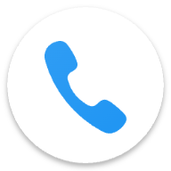

# Rill Phone

Rill Phone is a modern phone and contact management app that prioritizes your privacy. Featuring a clean interface inspired by contemporary Google Material Design, it offers a familiar and intuitive user experience without any ads or tracking. The app is completely transparent and does not collect or transmit any of your personal data, ensuring your calls and contacts remain private and secure.   

## ☕ Support the Project

If you find **Rill Phone** useful and would like to support its development, consider
buying me a coffee! Your support helps me maintain and improve this project.

*Every contribution, no matter how small, helps keep this project alive and growing! ❤️*  
