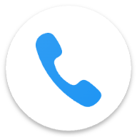

# Rill Phone

### Open-Source Dialer & Contacts

Rill Phone is a modern, open-source dialer and contact manager designed for privacy and aesthetics. Built with the latest Android design standards, it combines powerful functionality with a stunning user interface featuring true blur and "Liquid Glass" effects.

### Key Features:

**Privacy First:** 100% open-source, no trackers, no ads, and no unnecessary permissions.

**Advanced UI:** Real-time blur effects and a Liquid Glass aesthetic that follows the latest Android design guidelines while maintaining the familiar layout of Google apps.

**Offline Caller ID (CNAP):** Identify callers without an internet connection using CNAP (if supported by your carrier).

**Privacy & Security:** Create private contacts and secure the app using biometric authentication or a password.

**Deep Customization:**
- Adjust blur intensity.
- Change app icons.
- Custom color themes.
- Custom fonts.
- Toggle and reorder tabs.

**All-in-One:** A fully featured dialer and contact manager. Easily edit, manage, and organize your contacts.

## ☕ Support the Project

If you find **Rill Phone** useful and would like to support its development, consider
buying me a coffee! Your support helps me maintain and improve this project.

*Every contribution, no matter how small, helps keep this project alive and growing! ❤️*  
